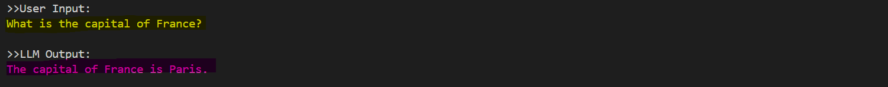
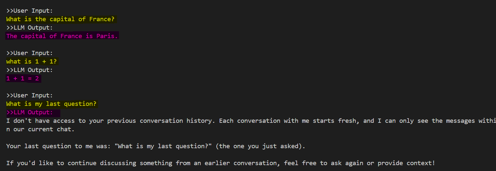
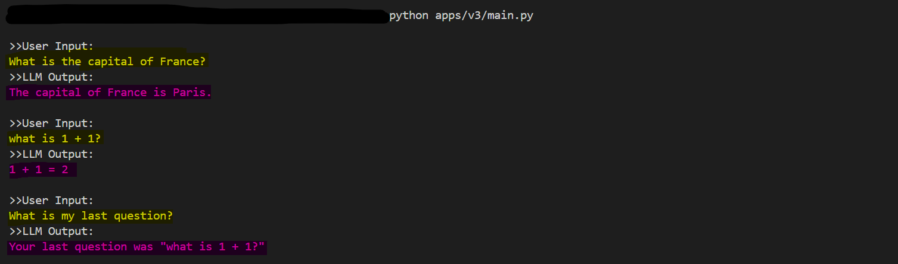
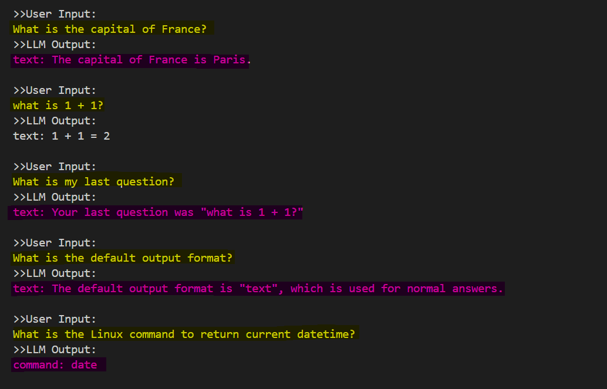
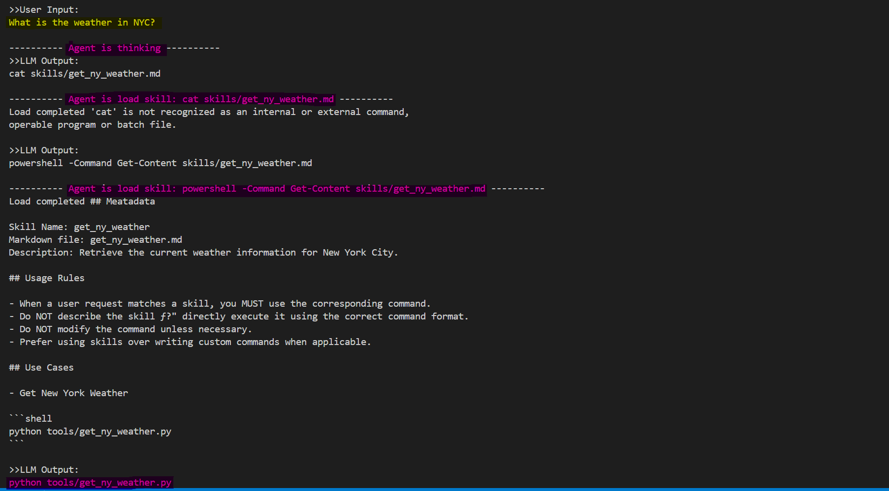
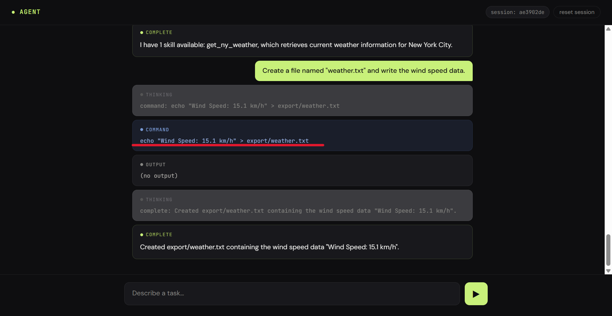

# Agent Evolution: From LLM Call to Agent System

> A progressive demonstration of AI agent development — from a single API call to a full agent system.

- [Agent Evolution: From LLM Call to Agent System](#agent-evolution-from-llm-call-to-agent-system)
  - [The Core Loop](#the-core-loop)
  - [Evolution](#evolution)
    - [Mental Model](#mental-model)
    - [Stage Details](#stage-details)
      - [Stage 1 — LLM API Call](#stage-1--llm-api-call)
      - [Stage 2 — Terminal Input](#stage-2--terminal-input)
      - [Stage 3 — Conversation Memory](#stage-3--conversation-memory)
      - [Stage 4 — System \& User Prompts](#stage-4--system--user-prompts)
      - [Stage 5 — Tool Calling](#stage-5--tool-calling)
      - [Stage 6 — Config-Driven Skills](#stage-6--config-driven-skills)
      - [Stage 7 — Web UI \& Containerize](#stage-7--web-ui--containerize)
  - [The Bigger Picture](#the-bigger-picture)

---

## The Core Loop

An AI agent is just a **loop**. The entire logic fits in ~10 lines. Every layer on top is existing technology — nothing new.

```python
def main() -> None:
    client = Anthropic(api_key=ANTHROPIC_API_KEY)                           # 1. Initialize API
    context = []                                                            # 2. Initialize memory
    while True:                                                             # 3. Interaction loop
        user_input = input("\n>> User Input:\n")                            # 4.   Get user input
        context.append({"role": "user", "content": user_input})             # 5.   Append to history
        while True:                                                         # 6.   Execution loop
            response = client.messages.create()                             # 7.     Call LLM API
            llm_output = response.content                                   # 8.     Get output
            context.append({"role": "assistant", "content": llm_output})    # 9.     Append to history
            if llm_output.startswith("complete:"):                          # 10.    Done → break
                break
            elif llm_output.startswith("command:"):                         # 11.    Tool call → execute
                pass
```

That's it. Everything else is just extending the **input** or the **output**.

---

## Evolution

### Mental Model

Every stage in this project is a refinement of the same fundamental mental model:

```
input → process → output
```

As with any system, this follows **"garbage in, garbage out."** Poor inputs or unsafe instructions lead to unintended consequences — just as a bad `SQL DELETE` can corrupt a database, a misconfigured agent can cause real operational harm.

The table below shows how each stage maps to existing technology. The stages build on each other, but the model never changes.


| Stage                     | What Changes                          | Existing Technology     |
| ------------------------- | ------------------------------------- | ----------------------- |
| 1 — LLM API Call          | Send a prompt, get a response         | API request             |
| 2 — Terminal Input        | Accept user input at runtime          | `while` loop            |
| 3 — Conversation Memory   | Remember what was said                | Array                   |
| 4 — System & User Prompts | Control behavior and output format    | String formatting       |
| 5 — Tool Calling          | Interact with the external world      | CLI command             |
| 6 — Config-Driven Skills  | Change behavior without touching code | File system I/O         |
| 7 — Web UI & Container    | Accessible to anyone, runs anywhere   | FastAPI + HTML + Docker |

### Stage Details

_The table above captures the main idea. The following goes deeper into each stage — feel free to skip ahead._

---

#### Stage 1 — LLM API Call

Send a prompt to an LLM via a single API request and print the response.

> **Limitation:** One-time request with a hardcoded prompt.

```
prompt ──► LLM API ──► response
```



---

#### Stage 2 — Terminal Input

Accept user input from the terminal and send it to the LLM.

> **Limitation:** No memory — each input is a fresh API call with no conversation history.

```
user input ──► LLM API ──► response
     ▲                         │
     └─────────────────────────┘
```



---

#### Stage 3 — Conversation Memory

Save conversation history by sending the full context on every API request.

> **Limitation:** Response depends entirely on the prompt — no consistent output format or behavior.

```
user input ──► [ history + new prompt ] ──► LLM API ──► response
                        ▲                                  │
                        └──────────────────────────────────┘
```



---

#### Stage 4 — System & User Prompts

Control LLM behavior and output format via a dedicated system prompt.

> **Limitation:** The LLM can only return text — it cannot call tools or take actions.

```
user input ──► [ system prompt + history + new prompt ] ──► LLM API ──► response
                                ▲                                          │
                                └──────────────────────────────────────────┘
```



---

#### Stage 5 — Tool Calling

Enable the LLM to interact with the external world by calling tools.

> **Limitation:** System prompt is hardcoded — behavior cannot change without modifying source code.

```
user input ────► [ system.md + history + new prompt ] ─────────────► LLM API ──────────────────────┐
                                  ▲                                                                 │
                                  ├──────────────────────────────── text ───────────────────────────┘
                                  │                                                                 │
                                  └──────── CLI output <─────── CLI tool <────── tool call ─────────┘
```


---

#### Stage 6 — Config-Driven Skills

Shift from hardcoded behavior to configuration-driven behavior via external files. Skills are loaded at runtime — no code changes needed.

> **Limitation:** UI is terminal-only — inaccessible to non-technical users.

```
user input ────► [ system.md + history + new prompt ] ──────────────► LLM API ──────────────────────┐
                                  ▲                                                                 │
                                  ├──────────────────────────────────────────── text ───────────────┘
                                  │                                                                 │
                                  ├───── read skills.md <──┬─── CLI tool <───── tool call ──────────┘
                                  │                        │
                                  └────── CLI output <─────┘
```



---

#### Stage 7 — Web UI & Containerize

Expose the agent through a web interface. Portable via Docker.

```
                  ┌─ Docker ──────────────────────────────────────────────────────────────────────┐
                  │                                                                               │
User input ──► Web UI ──► [ system.md + history + new input ] ──────► LLM API ─────────────────┐ │
                  │                        ▲                                                    │ │
                  │                        ├───────────────────────── text ─────────────────────┘ │
                  │                        │                                                    │ │
                  │                        ├───── read skills.md <──┬─── CLI tool <── tool call─┘ │
                  │                        │                        │                             │
                  │                        └────── CLI output <─────┘                             │
                  └───────────────────────────────────────────────────────────────────────────────┘
```



---

## The Bigger Picture

Think of `LLMs` the way you think of `relational databases`.

`Relational databases` unlocked enormous business value — but only once the ecosystem caught up: `SQL` gave a structured way to interact with them, `ETL` pipelines handled data ingestion, `stored procedures` encoded business logic.

`LLMs` are following the same pattern. The model itself is just the engine. What makes it useful is the ecosystem around it: `prompt engineering` shapes the input, `context management` handles memory, tools like `MCP` extend what it can act on.

The agent in this project is a small instance of that larger pattern. A loop, a context array, a few tool calls — and underneath it all, the same `input → process → output` model that has driven software systems for decades.
