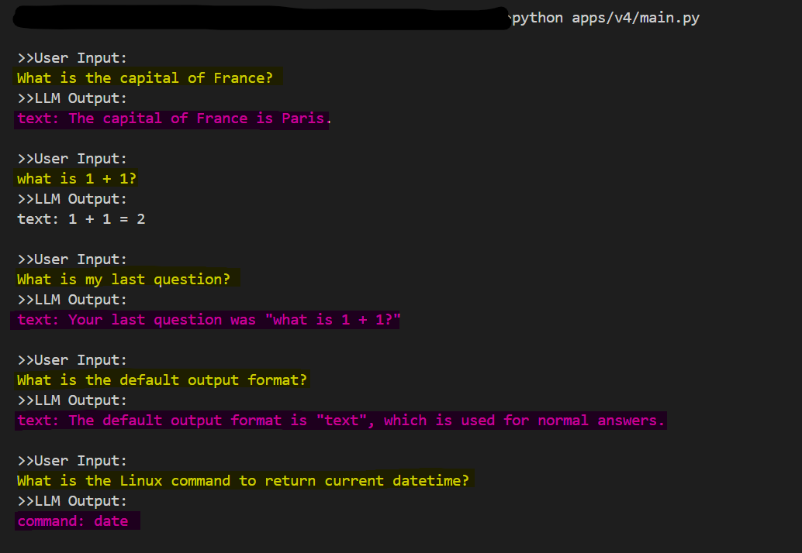

## Test



```bash
python apps/v4/main.py
# >>User Input:
# What is the capital of France?
# >>LLM Output:
# text: The capital of France is Paris.

# >>User Input:
# what is 1 + 1?
# >>LLM Output:
# text: 1 + 1 = 2

# >>User Input:
# What is my last question?
# >>LLM Output:
# text: Your last question was "what is 1 + 1?"

# >>User Input:
# What is the default output format?
# >>LLM Output:
# text: The default output format is "text", which is used for normal answers.

# >>User Input:
# What is the Linux command to return current datetime?
# >>LLM Output:
# command: date

```
