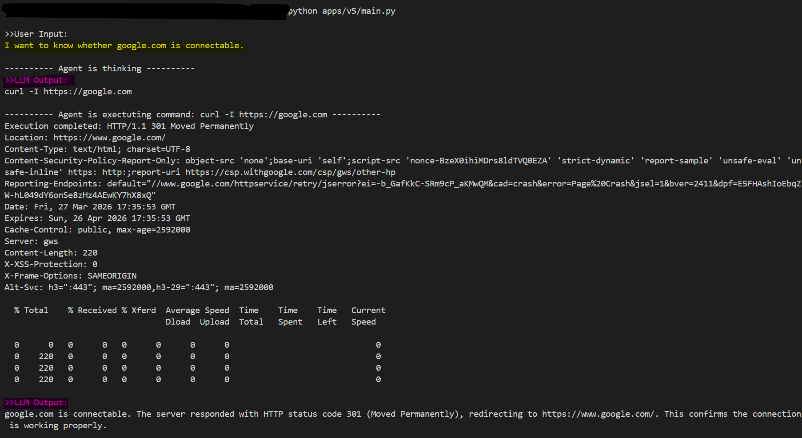
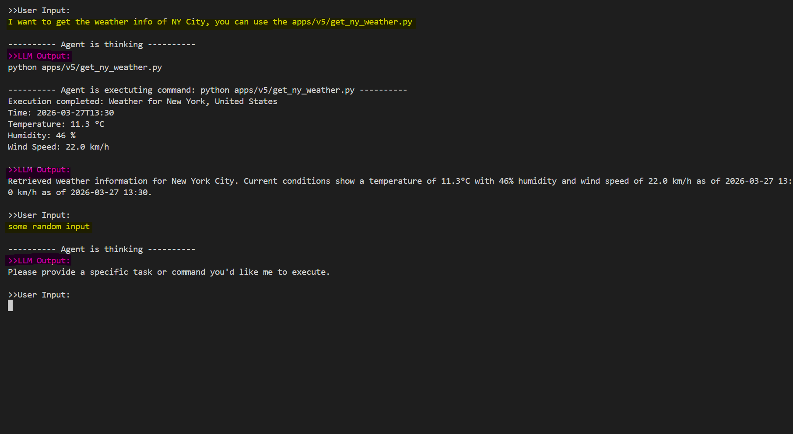

## Test





```bash
python apps/v5/main.py
# >>User Input:
# I want to know whether google.com is connectable.

# ---------- Agent is thinking ----------
# >>Agent Executing:
#  ping -c 4 google.com

# ---------- Agent is exectuting command: ping -c 4 google.com ----------
# Execution completed Access denied. Option -c requires administrative privileges.

# >>Agent Executing:
#  ping google.com

# ---------- Agent is exectuting command: ping google.com ----------
# Execution completed
# Pinging google.com [2607:f8b0:4023:1804::64] with 32 bytes of data:
# Reply from 2607:f8b0:4023:1804::64: time=17ms
# Reply from 2607:f8b0:4023:1804::64: time=58ms
# Reply from 2607:f8b0:4023:1804::64: time=81ms
# Reply from 2607:f8b0:4023:1804::64: time=26ms

# Ping statistics for 2607:f8b0:4023:1804::64:
#     Packets: Sent = 4, Received = 4, Lost = 0 (0% loss),
# Approximate round trip times in milli-seconds:
#     Minimum = 17ms, Maximum = 81ms, Average = 45ms

# >>LLM Output:
# google.com is connectable. All 4 ping packets were successfully received with 0% packet loss and an average response time of 45ms, indicating a stable connection to google.com.

# >>User Input:
# I want to get the weather info of NY City, you can use the apps/v5/get_ny_weather.py

# ---------- Agent is thinking ----------
# >>Agent Executing:
#  python apps/v5/get_ny_weather.py

# ---------- Agent is exectuting command: python apps/v5/get_ny_weather.py ----------
# Execution completed Weather for New York, United States
# Time: 2026-03-27T13:30
# Temperature: 11.3 °C
# Humidity: 46 %
# Wind Speed: 22.7 km/h

# >>LLM Output:
# Weather information for New York City retrieved successfully. Current conditions show a temperature of 11.3°C, humidity at 46%, and wind speed of 22.7 km/h as of 13:30 on March 27, 2026.

# >>User Input:
# some random input

# ---------- Agent is thinking ----------
# >>LLM Output:
# Please provide a specific task you'd like me to execute, such as running a command, checking connectivity, or retrieving information.
```
