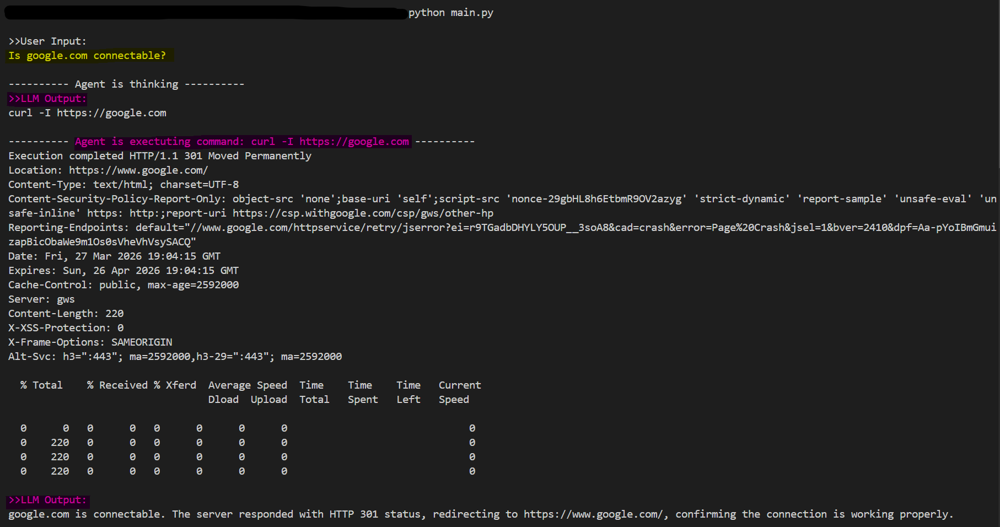
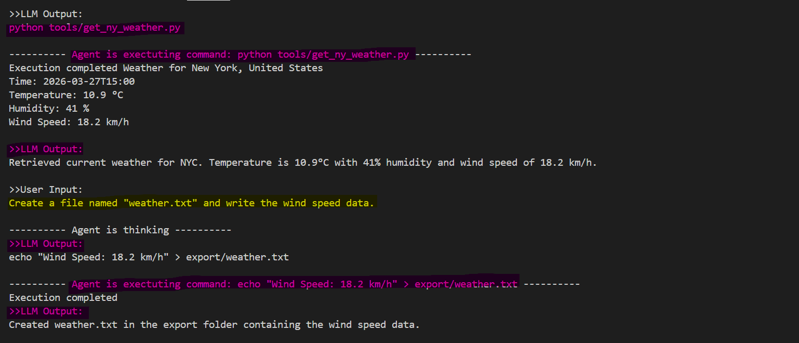
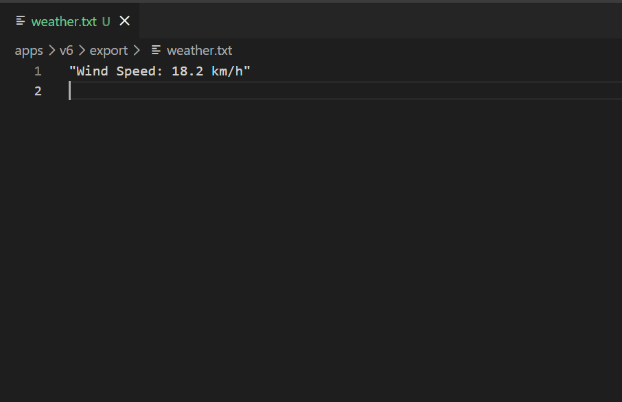

## Test






````bash
cd apps/v6
python main.py
# >>User Input:
# Is google.com connectable?

# ---------- Agent is thinking ----------
# >>LLM Output:
# curl -I https://google.com

# ---------- Agent is exectuting command: curl -I https://google.com ----------
# Execution completed HTTP/1.1 301 Moved Permanently
# Location: https://www.google.com/
# Content-Type: text/html; charset=UTF-8
# Content-Security-Policy-Report-Only: object-src 'none';base-uri 'self';script-src 'nonce-29gbHL8h6EtbmR9OV2azyg' 'strict-dynamic' 'report-sample' 'unsafe-eval' 'unsafe-inline' https: http:;report-uri https://csp.withgoogle.com/csp/gws/other-hp
# Reporting-Endpoints: default="//www.google.com/httpservice/retry/jserror?ei=r9TGadbDHYLY5OUP__3soA8&cad=crash&error=Page%20Crash&jsel=1&bver=2410&dpf=Aa-pYoIBmGmuizapBicObaWe9m1Os0sVheVhVsySACQ"
# Date: Fri, 27 Mar 2026 19:04:15 GMT
# Expires: Sun, 26 Apr 2026 19:04:15 GMT
# Cache-Control: public, max-age=2592000
# Server: gws
# Content-Length: 220
# X-XSS-Protection: 0
# X-Frame-Options: SAMEORIGIN
# Alt-Svc: h3=":443"; ma=2592000,h3-29=":443"; ma=2592000

#   % Total    % Received % Xferd  Average Speed  Time    Time    Time   Current
#                                  Dload  Upload  Total   Spent   Left   Speed

#   0      0   0      0   0      0      0      0                              0
#   0    220   0      0   0      0      0      0                              0
#   0    220   0      0   0      0      0      0                              0
#   0    220   0      0   0      0      0      0                              0

# >>LLM Output:
# google.com is connectable. The server responded with HTTP 301 status, redirecting to https://www.google.com/, confirming the connection is working properly.

# >>User Input:
# What is the weather in NYC?

# ---------- Agent is thinking ----------
# >>LLM Output:
# cat skills/get_ny_weather.md

# ---------- Agent is load skill: cat skills/get_ny_weather.md ----------
# Load completed 'cat' is not recognized as an internal or external command,
# operable program or batch file.

# >>LLM Output:
# powershell -Command Get-Content skills/get_ny_weather.md

# ---------- Agent is load skill: powershell -Command Get-Content skills/get_ny_weather.md ----------
# Load completed ## Meatadata

# Skill Name: get_ny_weather
# Markdown file: get_ny_weather.md
# Description: Retrieve the current weather information for New York City.

# ## Usage Rules

# - When a user request matches a skill, you MUST use the corresponding command.
# - Do NOT describe the skill ƒ?" directly execute it using the correct command format.
# - Do NOT modify the command unless necessary.
# - Prefer using skills over writing custom commands when applicable.

# ## Use Cases

# - Get New York Weather

# ```shell
# python tools/get_ny_weather.py
# ```

# >>LLM Output:
# python tools/get_ny_weather.py

# ---------- Agent is exectuting command: python tools/get_ny_weather.py ----------
# Execution completed Weather for New York, United States
# Time: 2026-03-27T15:00
# Temperature: 10.9 °C
# Humidity: 41 %
# Wind Speed: 18.2 km/h

# >>LLM Output:
# Retrieved current weather for NYC. Temperature is 10.9°C with 41% humidity and wind speed of 18.2 km/h.

# >>User Input:
# Create a file named "weather.txt" and write the wind speed data.

# ---------- Agent is thinking ----------
# >>LLM Output:
# echo "Wind Speed: 18.2 km/h" > export/weather.txt

# ---------- Agent is exectuting command: echo "Wind Speed: 18.2 km/h" > export/weather.txt ----------
# Execution completed
# >>LLM Output:
# Created weather.txt in the export folder containing the wind speed data.
````
